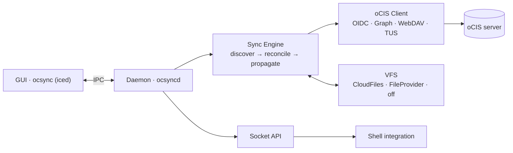

<div align="center">

# 🦀 ownCloud Sync Client

### Next-generation [ownCloud Infinite Scale](https://owncloud.dev/) sync, rebuilt from the ground up in Rust.

[](https://github.com/deepdiver1975/owncloud-sync-client/actions/workflows/ci.yml)
[](#-license)
[](https://www.rust-lang.org/)
[](#-platform-support)

</div>

---

A modern desktop sync client that keeps your local folders in lockstep with **ownCloud Infinite Scale (oCIS)** Spaces. It's a clean-slate rewrite of the classic ownCloud desktop client in **memory-safe, fully-async Rust** — a headless sync daemon paired with a native GUI, OIDC login, and per-platform virtual-file integration so files appear instantly and download only when you need them.

## ✨ Features

| | |
|---|---|
| 🔄 **Real-time sync** | Bidirectional sync driven by a filesystem watcher plus a periodic remote poll |
| 🗂️ **Multi-account & multi-space** | Connect several oCIS accounts and pick exactly which Spaces to sync, discovered at runtime |
| 👻 **Virtual files** | Windows CloudFiles placeholders, macOS FileProvider, full-download fallback on Linux |
| ⚔️ **Conflict resolution** | `KeepBoth` (default), `KeepRemote`, or `KeepLocal` strategies |
| ⏯️ **Per-folder control** | Pause and resume individual folders with live sync progress |
| 🐚 **Shell integration** | COM overlays & context menus (Windows), Finder badges (macOS), D-Bus + Nautilus/Dolphin menus (Linux) |
| 🔐 **Secure auth** | OIDC (PKCE) login via your system browser; tokens stored in the OS keychain |
| ⬆️ **Resumable uploads** | TUS chunked uploads for large files |
| 🌍 **Internationalized** | Live language switching across English, German, French, and Chinese |
| 🛎️ **System tray & About** | Tray icon with sync status, show/hide window, and an About page |

## 🏗️ Architecture

The client is split into a **headless daemon** (`ocsyncd`) that does all the syncing and a **GUI** (`ocsync`, built with [`iced`](https://iced.rs/)) that talks to it over a local IPC socket. This keeps the sync engine running independently of the UI and makes it pure, platform-agnostic, and fully unit-testable.



- **Daemon + GUI separation** — the daemon survives GUI restarts and can run without any UI at all.
- **Pure async sync engine** — a three-phase pipeline (discovery → reconciliation → propagation) with no platform or GUI dependencies.
- **VFS trait abstraction** — one `Vfs` trait, with native implementations selected per platform.

See [`docs/architecture.md`](docs/architecture.md) for the full design.

## 🚀 Quickstart

**Prerequisites**

- A Rust toolchain via [rustup](https://rustup.rs/) (`cargo`)
- [`just`](https://github.com/casey/just) for the task recipes
- On Linux: `libdbus-1-dev`, `pkg-config`, `libsecret-1-dev`

**Build & run**

```sh
just build            # or: cargo build --workspace
just build-release    # optimized build

cargo run -p daemon --release   # ocsyncd — the headless sync daemon
cargo run -p gui --release      # ocsync  — the GUI (spawns the daemon if needed)
```

## ⚙️ Configuration

Accounts, folders, and VFS modes are managed entirely through the GUI — no hand-editing required. Under the hood, settings live in a TOML file and credentials are kept in your OS keychain:

| Platform | Config location |
|---|---|
| Linux | `~/.config/owncloud/owncloud.toml` |
| macOS | `~/Library/Application Support/ownCloud/owncloud.toml` |
| Windows | `%APPDATA%\ownCloud\owncloud.toml` |

## 🧪 Testing & Development

```sh
just test     # run the workspace test suite
just lint     # clippy with warnings denied
just fmt      # format all sources
just ci       # fmt-check + lint + test (the CI gate)
```

End-to-end acceptance tests drive the real GUI against a Dockerized oCIS instance via Playwright:

```sh
just acceptance-setup   # one-time: install Playwright + Chromium
just acceptance         # requires Docker and a display server
```

## 🗂️ Project layout

A Cargo workspace of focused crates:

| Crate | Role |
|---|---|
| `sync-db` | SQLite sync journal (per-folder state & metadata) |
| `ocis-client` | oCIS HTTP client — OIDC, Graph API, WebDAV, TUS |
| `vfs-core` | The platform-agnostic `Vfs` trait |
| `vfs-windows` / `vfs-macos` / `vfs-off` | Per-platform VFS backends |
| `sync-engine` | The discover → reconcile → propagate pipeline |
| `socket-api` | Socket protocol for shell integration |
| `daemon` | The `ocsyncd` sync daemon |
| `gui` | The `ocsync` desktop GUI |
| `acceptance-test` | End-to-end test suite |
| `oc-dbus-service` | Linux D-Bus service for shell integration |

## 📦 Platform support

| Platform | Virtual files | Shell integration |
|---|---|---|
| **Linux** | Full download (`vfs-off`) | D-Bus service + Nautilus / Dolphin menus |
| **macOS** | FileProvider extension | Finder badges & toolbar items |
| **Windows** | CloudFiles API placeholders | COM overlay icons & context menus |

## 📄 License

Licensed under **GPL-2.0-or-later** (see the `license` field in [`Cargo.toml`](Cargo.toml)).
